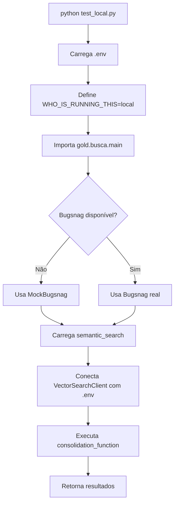

# Guia de Modificações para Execução Local

Este documento detalha todas as modificações feitas no código original para permitir execução local mantendo compatibilidade com Databricks.

## Resumo das Modificações

| Componente | Modificação | Motivo |
|------------|-------------|--------|
| Bugsnag | Tornado opcional | Não necessário localmente |
| AWS Utils | Mock criado | Não necessário localmente |
| Imports | Relativos + Absolutos | Suportar import como módulo e execução direta |
| Credenciais | Via .env | Configuração local segura |
| Vector Search | Config via .env | Conectar ao Databricks remotamente |

---

## Modificações Detalhadas

### 1. Bugsnag Tornado Opcional

**Arquivos modificados:**
- `src/gold/busca/main.py`
- `src/gold/busca/fuzzy_search.py`
- `src/gold/busca/semantic_search.py`

**Antes:**
```python
import bugsnag

# ... código
bugsnag.notify(Exception("Teste"))
```

**Depois:**
```python
# Importa bugsnag apenas se disponível
try:
    import bugsnag
except ImportError:
    # Mock do bugsnag para ambiente local
    class MockBugsnag:
        @staticmethod
        def notify(exception):
            pass  # Ignora notificações em ambiente local
    bugsnag = MockBugsnag()

# ... código continua funcionando
bugsnag.notify(Exception("Teste"))  # Não dá erro se bugsnag não estiver instalado
```

**Benefício:** Código funciona sem instalar bugsnag (pacote usado apenas em produção).

---

### 2. AWS Utils Tornado Opcional

**Arquivo modificado:** `src/gold/busca/semantic_search.py`

**Antes:**
```python
from utils.aws_utils import secrets
```

**Depois:**
```python
# Tenta importar AWS utils (opcional - só usado em prod)
try:
    from utils.aws_utils import secrets
except (ImportError, ModuleNotFoundError):
    # Mock para ambiente local sem AWS
    class MockSecrets:
        @staticmethod
        def get_secret(secret_name):
            return {secret_name: None}
    secrets = MockSecrets()
```

**Benefício:** Não precisa de boto3 (AWS SDK) instalado localmente.

---

### 3. Imports Relativos e Absolutos

**Arquivos modificados:**
- `src/gold/busca/main.py`
- `src/gold/busca/fuzzy_search.py`
- `src/gold/busca/semantic_search.py`

**Problema:** Imports falhavam quando código era importado como módulo.

**Solução:**

```python
# Tenta import relativo (quando importado como módulo)
try:
    from .fuzzy_search import *
    from .semantic_search import *
except ImportError:
    # Fallback para import absoluto (quando executado diretamente)
    from fuzzy_search import *
    from semantic_search import *
```

**Benefício:** Funciona tanto em `python test_local.py` quanto em `cd src/gold/busca && python main.py`.

---

### 4. Carregamento de Credenciais via .env

**Arquivo modificado:** `src/gold/busca/semantic_search.py`

**Adicionado:**
```python
from dotenv import load_dotenv

# Carrega variáveis de ambiente para execução local
load_dotenv()
```

**Configuração do Vector Search Client:**

```python
def _configure_vector_search_client(self):
    runner = str(os.getenv("WHO_IS_RUNNING_THIS"))

    # Se rodando localmente, configura com credenciais do .env
    if runner == "local" or (not host and runner not in ["ENDPOINT_NOTEBOOK", "ENDPOINT_MLFLOW"]):
        print("LOG: Running locally. Using credentials from .env file...")
        databricks_host = os.getenv("DATABRICKS_HOST")
        databricks_token = os.getenv("DATABRICKS_TOKEN")

        if not databricks_host or not databricks_token:
            raise ValueError(
                "DATABRICKS_HOST and DATABRICKS_TOKEN must be set in .env file.\n"
                "Copy .env.config to .env and fill in your credentials."
            )

        # Garante que o host tem https://
        if not databricks_host.startswith("https://"):
            databricks_host = f"https://{databricks_host}"

        return VectorSearchClient(
            workspace_url=databricks_host,
            personal_access_token=databricks_token,
            disable_notice=True
        )
```

**Benefício:** Credenciais não ficam hardcoded no código.

---

### 5. Dynamic Catalog Adaptado

**Arquivo modificado:** `src/utils/dynamic_cat/dynamic_catalog.py`

**Adicionado suporte para .env:**

```python
def get_host():
    """
    Retorna a URL do workspace Databricks atual.
    Se rodando localmente, retorna do .env.
    """
    # Se rodando localmente, pega do .env
    if os.getenv("WHO_IS_RUNNING_THIS") == "local" or not os.getenv("DATABRICKS_HOST"):
        load_dotenv()
        databricks_host = os.getenv("DATABRICKS_HOST", "")
        return databricks_host.replace("https://", "").replace("http://", "")

    # Se rodando no Databricks, pega do Spark
    spark = _spark()
    workspace_url = spark.conf.get("spark.databricks.workspaceUrl").lower()
    return workspace_url
```

---

### 6. Bloco de Teste no main.py

**Arquivo modificado:** `src/gold/busca/main.py`

**Antes:** Código de teste comentado, precisava descomentar manualmente.

**Depois:** Bloco executável automático:

```python
if __name__ == "__main__":
    import pandas as pd
    from dotenv import load_dotenv

    # Carrega credenciais do .env
    load_dotenv()
    os.environ["WHO_IS_RUNNING_THIS"] = "local"

    # Dados de teste
    data = {...}

    # Carrega o CSV
    file_csv = pd.read_csv("./books_search.csv", encoding="utf-8")

    # Executa a busca
    result = consolidation_function(data, file_csv, local=True)

    # Exibe resultados formatados
    print(f"Success: {result.get('success')}")
    # ...
```

**Benefício:** Pode executar `python main.py` diretamente para testar.

---

## Arquivos Criados

### 1. `.env.config` (Template)
Template de configuração com exemplo de credenciais.

### 2. `.gitignore`
```
.env
__pycache__/
*.pyc
venv/
```

### 3. `test_local.py`
Script de teste completo que:
- Verifica se `.env` existe
- Executa múltiplos testes (busca livre e por campos)
- Exibe resultados formatados

### 4. Documentação
- `README.md` - Guia sucinto quick start
- `MODIFICACOES_LOCAL.md` - Este arquivo
- `PYTHON_SETUP.md` - Setup Python 3.10/3.11
- `INSTALL.md` - Troubleshooting instalação

---

## 🔄 Fluxo de Execução Local



---

## Compatibilidade Mantida

Todas as modificações mantêm compatibilidade com os modos originais:

| Modo | Configuração | Funcionamento |
|------|--------------|---------------|
| `ENDPOINT_NOTEBOOK` | Databricks Notebook | Mantido (usa imports originais) |
| `ENDPOINT_MLFLOW` | MLflow Endpoint | Mantido (usa imports originais) |
| `local` | **NOVO** - Via .env | Adicionado |

**Nenhuma linha de código dos modos originais foi removida!**

---

## Segurança

### Credenciais
- ✅ `.env` está no `.gitignore`
- ✅ `.env.example` é apenas template (sem credenciais reais)
- ✅ Código valida se credenciais estão presentes

---

## Resumo das Dependências

### Originais (Databricks)
```
pandas
databricks-vectorsearch
databricks-langchain
rapidfuzz
```

### Adicionadas para Local
```
python-dotenv  # Carregar .env
```

### Removidas/Opcionais
```
bugsnag  # Agora opcional
boto3    # Não necessário
```

---

